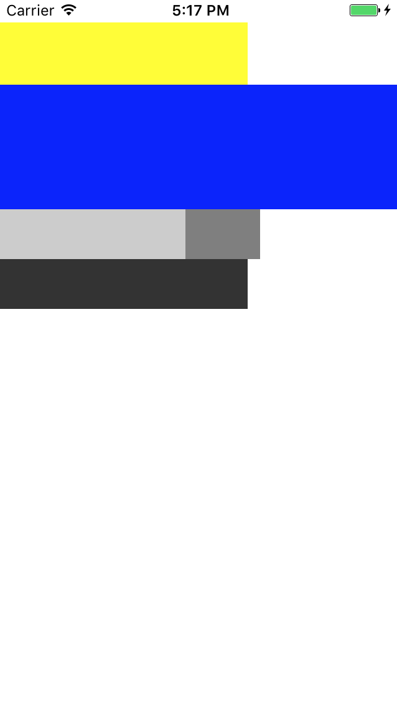

# ALView
ALView is not just an autolayout framework, but also provide a fastest way to layout like html's flow layout.

### \# You can layout by use display:block & display:inline
####[demo1] - flow layout
----
```objective-c
// new a block view as a body view
ALView * body = [[ALView alloc] init];
body.marginTop = 20;
[body addTo: self.view];

// new a block view
ALView * blockArticle = [[ALView alloc] init];
// if you did not set `display`, default is ALDisplayBlock
// blockArticle.display = ALDisplayBlock;
blockArticle.height = 50;
blockArticle.width = 200;
blockArticle.backgroundColor = [UIColor yellowColor];
[blockArticle addTo:body];

// new a block view again
ALView * blockArticle2 = [[ALView alloc] init];
blockArticle2.height = 100;
// if you did not set `width`, default is parent's width
blockArticle2.backgroundColor = [UIColor blueColor];
[blockArticle2 addTo:body];

// new a inline view
ALView * inlineTx1 = [[ALView alloc] init];
inlineTx1.display = ALDisplayInline;
inlineTx1.height = 40;
inlineTx1.width = 150;
inlineTx1.backgroundColor = [UIColor colorWithRed:0 green:0 blue:0 alpha:0.2];
[inlineTx1 addTo:body];

ALView * inlineTx2 = [[ALView alloc] init];
inlineTx2.display = ALDisplayInline;
inlineTx2.height = 40;
inlineTx2.width = 60;
inlineTx2.backgroundColor = [UIColor colorWithRed:0 green:0 blue:0 alpha:0.5];
[inlineTx2 addTo:body];

ALView * inlineTx3 = [[ALView alloc] init];
inlineTx3.display = ALDisplayInline;
inlineTx3.height = 40;
// will break in new line if need
inlineTx3.width = 200;
inlineTx3.backgroundColor = [UIColor colorWithRed:0 green:0 blue:0 alpha:0.8];
[inlineTx3 addTo:body];
```
####[result]
------


####[demo] - auto height & auto width
```objective-c
ALView * body = [[ALView alloc] init];
body.marginTop = 20;
[body addTo: self.view];

ALView * blockArticle = [[ALView alloc] init];
// if you did not set `height` property, it will auto update height by subview's total height
// which feature is also fit to inline view
// blockArticle.height = 50;
blockArticle.backgroundColor = [UIColor yellowColor];
[blockArticle addTo:body];

// create an inline view addto blockArticle
[[self createInlineViewWidth: 150 height:40 alpha:0.2] addTo: blockArticle];
[[self createInlineViewWidth: 60 height:40 alpha:0.5] addTo: blockArticle];
[[self createInlineViewWidth: 200 height:40 alpha:0.7] addTo: blockArticle];

ALView * inlineArticle = [[ALView alloc] init];
inlineArticle.display = ALDisplayInline;
// If you did not set `width` property on inline view
// It will auto update width by subview's total width, max width is parent's width
// inlineArticle.width = 320;
// inlineArticle.height = 50;
inlineArticle.backgroundColor = [UIColor redColor];
[inlineArticle addTo:body];

[[self createInlineViewWidth: 150 height:40 alpha:0.2] addTo: inlineArticle];
[[self createInlineViewWidth: 100 height:40 alpha:0.3] addTo: inlineArticle];
[[self createInlineViewWidth: 60 height:40 alpha:0.5] addTo: inlineArticle];
[[self createInlineViewWidth: 200 height:40 alpha:0.7] addTo: inlineArticle];

```
####[result]
------

### \# you can layout with marginTop, marginLeft, marginRight, marginBottom

// todo
### \# you also can layout by use position:relative & position:absolute

// todo
### \# layout with contentAlign:left/center/right is so nice

// todo
### \# we have `ALLabel` make things more easer

// todo