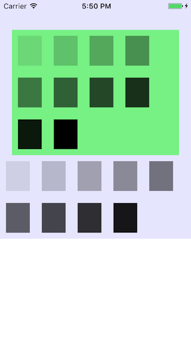

# ALView
ALView is not just an autolayout framework, but also provide a fastest way to layout like html's flow layout.

### \# You can use flowlayout by use block & inline
####[demo1] - flow layout
----
```objective-c
// new a block view as a body view
ALView * body = [[ALView alloc] init];
body.marginTop = 20;
[body addTo: self.view];

// a block view always break in a new line
ALView * blockArticle = [[ALView alloc] init];
// if you did not set `display`, default is ALDisplayBlock
// blockArticle.display = ALDisplayBlock;
blockArticle.height = 50;
blockArticle.width = 200;
blockArticle.backgroundColor = [UIColor yellowColor];
[blockArticle addTo:body];

ALView * blockArticle2 = [[ALView alloc] init];
blockArticle2.height = 100;
// if you did not set `width`, default is parent's width
blockArticle2.backgroundColor = [UIColor blueColor];
[blockArticle2 addTo:body];

// if previous view is inline view, a new inline view will layout next to previous in same line
// if previous view is block view, a new inline view will layout next to previous view and break in a new line
ALView * inlineTx1 = [[ALView alloc] init];
inlineTx1.display = ALDisplayInline;
inlineTx1.height = 40;
inlineTx1.width = 150;
inlineTx1.backgroundColor = [UIColor colorWithRed:0 green:0 blue:0 alpha:0.2];
[inlineTx1 addTo:body];

ALView * inlineTx2 = [[ALView alloc] init];
inlineTx2.display = ALDisplayInline;
inlineTx2.height = 40;
inlineTx2.width = 60;
inlineTx2.backgroundColor = [UIColor colorWithRed:0 green:0 blue:0 alpha:0.5];
[inlineTx2 addTo:body];

ALView * inlineTx3 = [[ALView alloc] init];
inlineTx3.display = ALDisplayInline;
inlineTx3.height = 40;
// will break in new line if need
inlineTx3.width = 200;
inlineTx3.backgroundColor = [UIColor colorWithRed:0 green:0 blue:0 alpha:0.8];
[inlineTx3 addTo:body];
```
####[result]
------


####[demo2] - auto height & auto width
```objective-c
ALView * body = [[ALView alloc] init];
body.marginTop = 20;
[body addTo: self.view];

ALView * blockArticle = [[ALView alloc] init];
// if you did not set `height` property, it will auto update height by subview's total height
// which feature is also fit to inline view
// blockArticle.height = 50;
blockArticle.backgroundColor = [UIColor yellowColor];
[blockArticle addTo:body];

// create an inline view addto blockArticle
[[self createInlineViewWidth: 150 height:40 alpha:0.2] addTo: blockArticle];
[[self createInlineViewWidth: 60 height:40 alpha:0.5] addTo: blockArticle];
[[self createInlineViewWidth: 200 height:40 alpha:0.7] addTo: blockArticle];

ALView * inlineArticle = [[ALView alloc] init];
inlineArticle.display = ALDisplayInline;
// If you did not set `width` property on inline view
// It will auto update width by subview's total width, max width is parent's width
// inlineArticle.width = 320;
// inlineArticle.height = 50;
inlineArticle.backgroundColor = [UIColor redColor];
[inlineArticle addTo:body];

[[self createInlineViewWidth: 150 height:40 alpha:0.2] addTo: inlineArticle];
[[self createInlineViewWidth: 100 height:40 alpha:0.3] addTo: inlineArticle];
[[self createInlineViewWidth: 60 height:40 alpha:0.5] addTo: inlineArticle];
[[self createInlineViewWidth: 200 height:40 alpha:0.7] addTo: inlineArticle];

```
####[result]
------

### \# you can layout with marginTop, marginLeft, marginRight, marginBottom
####[demo1]
```objective-c
ALView * body = [[ALView alloc] init];
body.backgroundColor = [UIColor colorWithRed:0 green:0 blue:1 alpha:0.1];
[body addTo:self.view];

ALView * article2 = [[ALView alloc] init];
article2.backgroundColor = [UIColor colorWithRed:0 green:1 blue:0 alpha:0.5];
article2.marginTop = 50;
article2.marginLeft = 20;
article2.marginRight = 20;
[article2 addTo:body];

[[self createInlineBox1:0.1] addTo:article2];
[[self createInlineBox1:0.2] addTo:article2];
[[self createInlineBox1:0.3] addTo:article2];
[[self createInlineBox1:0.4] addTo:article2];
[[self createInlineBox1:0.5] addTo:article2];
[[self createInlineBox1:0.6] addTo:article2];
[[self createInlineBox1:0.7] addTo:article2];
[[self createInlineBox1:0.8] addTo:article2];
[[self createInlineBox1:0.9] addTo:article2];
[[self createInlineBox1:1.0] addTo:article2];

[[self createInlineBox1:0.1] addTo:body];
[[self createInlineBox1:0.2] addTo:body];
[[self createInlineBox1:0.3] addTo:body];
[[self createInlineBox1:0.4] addTo:body];
[[self createInlineBox1:0.5] addTo:body];
[[self createInlineBox1:0.6] addTo:body];
[[self createInlineBox1:0.7] addTo:body];
[[self createInlineBox1:0.8] addTo:body];
[[self createInlineBox1:0.9] addTo:body];
    
    - (ALView *) createInlineBox1: (CGFloat) alpha
{
    ALView * subInline = [[ALView alloc] init];
    subInline.height = 50;
    subInline.width = 40;
    subInline.marginTop = 10;
    subInline.marginLeft = 10;
    subInline.marginRight = 10;
    subInline.marginBottom = 10;
    subInline.display = ALDisplayInline;
    subInline.backgroundColor = [UIColor colorWithRed:0 green:0 blue:0 alpha:alpha];
    return subInline;
}
```
####[result]
------

### \# you also can layout by use position:relative & position:absolute
####[demo1]
```objective-c
ALView * body = [[ALView alloc] init];
body.backgroundColor = [UIColor colorWithRed:0 green:0 blue:1 alpha:0.1];
body.height = 200;
body.marginTop = 100;
body.marginLeft = 50;
body.marginRight = 50;
[body addTo:self.view];

[[self createAbsoluteBox:10 left:10 right:0 bottom:0 alpha:0.1] addTo: body];
[[self createAbsoluteBox:10 left:0 right:10 bottom:0 alpha:0.2] addTo: body];
[[self createAbsoluteBox:0 left:10 right:0 bottom:10 alpha:0.3] addTo: body];
[[self createAbsoluteBox:0 left:0 right:10 bottom:10 alpha:0.4] addTo: body];


[[self createAbsoluteBox:-50 left:-50 right:0 bottom:0 alpha:0.1] addTo: body];
[[self createAbsoluteBox:-50 left:0 right:-50 bottom:0 alpha:0.2] addTo: body];
[[self createAbsoluteBox:0 left:-50 right:0 bottom:-50 alpha:0.3] addTo: body];
[[self createAbsoluteBox:0 left:0 right:-50 bottom:-50 alpha:0.4] addTo: body];

- (ALView *) createAbsoluteBox: (CGFloat) top left: (CGFloat) left right: (CGFloat) right bottom: (CGFloat) bottom alpha: (CGFloat) alpha
{
    ALView * box = [[ALView alloc] init];
    box.height = 40;
    box.width = 40;
    box.position = ALPositionAbsolute;
    if (top) box.top = top;
    if (left) box.left = left;
    if (right) box.right = right;
    if (bottom) box.bottom = bottom;
    box.backgroundColor = [UIColor colorWithRed:0 green:0 blue:0 alpha:alpha];
    return box;
}
```
####[result]

####[demo2] - top and bottom 's priority or left and right 's priority
```objective-c
ALView * body = [[ALView alloc] init];
body.backgroundColor = [UIColor colorWithRed:0 green:0 blue:1 alpha:0.1];
body.height = 200;
body.marginTop = 50;
body.marginLeft = 50;
body.marginRight = 50;
[body addTo:self.view];

// If you had set `left` property, then `right` propert is ignore
[[self createAbsoluteBox:0 left:10 right:10 bottom:0 alpha:0.2] addTo: body];
[[self createAbsoluteBox:0 left:0 right:10 bottom:0 alpha:0.4] addTo: body];

ALView * body2 = [[ALView alloc] init];
body2.backgroundColor = [UIColor colorWithRed:0 green:0 blue:1 alpha:0.1];
body2.height = 200;
body2.marginTop = 50;
body2.marginLeft = 50;
body2.marginRight = 50;
[body2 addTo:self.view];

// If you had set `top` property, then `bottom` propert is ignore
[[self createAbsoluteBox:10 left:0 right:0 bottom:10 alpha:0.2] addTo: body2];
[[self createAbsoluteBox:0 left:0 right:0 bottom:10 alpha:0.4] addTo: body2];
```
####[result]

### \# Layout with contentAlign:left/center/right is so nice
####[demo1] - contentAlign is suitable for block and inline view
```objective-c
ALView * body = [[ALView alloc] init];
body.marginTop = 20;
[body addTo: self.view];

ALView * artivle1 = [[ALView alloc] init];
artivle1.marginBottom = 20;
// default is ALContentAlignLeft
artivle1.contentAlign = ALContentAlignLeft;
artivle1.backgroundColor = [UIColor colorWithRed:0 green:0 blue:0 alpha:0.1];
[artivle1 addTo: body];

// You also can define an inline view
ALView * block1 = [[ALView alloc] init];
block1.width = 150;
block1.height = 100;
block1.backgroundColor = [UIColor yellowColor];
[block1 addTo: artivle1];

ALView * artivle2 = [[ALView alloc] init];
artivle2.marginBottom = 20;
artivle2.contentAlign = ALContentAlignCenter;
artivle2.backgroundColor = [UIColor colorWithRed:0 green:0 blue:0 alpha:0.1];
[artivle2 addTo: body];

ALView * block2 = [[ALView alloc] init];
block2.width = 150;
block2.height = 100;
block2.backgroundColor = [UIColor blueColor];
[block2 addTo: artivle2];

ALView * artivle3 = [[ALView alloc] init];
artivle3.marginBottom = 20;
artivle3.contentAlign = ALContentAlignRight;
artivle3.backgroundColor = [UIColor colorWithRed:0 green:0 blue:0 alpha:0.1];
[artivle3 addTo: body];

ALView * block3 = [[ALView alloc] init];
block3.width = 150;
block3.height = 100;
block3.backgroundColor = [UIColor redColor];
[block3 addTo: artivle3];
```
####[result]

####[demo2] when multile content ?
```objective-c
ALView * body = [[ALView alloc] init];
body.marginTop = 20;
[body addTo: self.view];

ALView * artivle1 = [[ALView alloc] init];
artivle1.marginBottom = 20;
artivle1.contentAlign = ALContentAlignLeft;
artivle1.backgroundColor = [UIColor colorWithRed:0 green:0 blue:0 alpha:0.1];
[artivle1 addTo: body];

[[self createInlineBox1:0.1] addTo:artivle1];
[[self createInlineBox1:0.2] addTo:artivle1];
[[self createInlineBox1:0.3] addTo:artivle1];
[[self createInlineBox1:0.4] addTo:artivle1];
[[self createInlineBox1:0.5] addTo:artivle1];
[[self createInlineBox1:0.6] addTo:artivle1];

ALView * artivle2 = [[ALView alloc] init];
artivle2.marginBottom = 20;
artivle2.contentAlign = ALContentAlignCenter;
artivle2.backgroundColor = [UIColor colorWithRed:0 green:0 blue:0 alpha:0.1];
[artivle2 addTo: body];

[[self createInlineBox1:0.1] addTo:artivle2];
[[self createInlineBox1:0.2] addTo:artivle2];
[[self createInlineBox1:0.3] addTo:artivle2];
[[self createInlineBox1:0.4] addTo:artivle2];
[[self createInlineBox1:0.5] addTo:artivle2];
[[self createInlineBox1:0.6] addTo:artivle2];

ALView * artivle3 = [[ALView alloc] init];
artivle3.marginBottom = 20;
artivle3.contentAlign = ALContentAlignRight;
artivle3.backgroundColor = [UIColor colorWithRed:0 green:0 blue:0 alpha:0.1];
[artivle3 addTo: body];

[[self createInlineBox1:0.1] addTo:artivle3];
[[self createInlineBox1:0.2] addTo:artivle3];
[[self createInlineBox1:0.3] addTo:artivle3];
[[self createInlineBox1:0.4] addTo:artivle3];
[[self createInlineBox1:0.5] addTo:artivle3];
[[self createInlineBox1:0.6] addTo:artivle3];
    
    - (ALView *) createInlineBox1: (CGFloat) alpha
{
    ALView * subInline = [[ALView alloc] init];
    subInline.height = 50;
    subInline.width = 40;
    subInline.marginTop = 10;
    subInline.marginLeft = 10;
    subInline.marginRight = 10;
    subInline.marginBottom = 10;
    subInline.display = ALDisplayInline;
    subInline.backgroundColor = [UIColor colorWithRed:0 green:0 blue:0 alpha:alpha];
    return subInline;
}

```
####[result]


### \# We have **ALLabel**, which make things more easer

####[demo1] - just use! did not have to care height/width

> ALLabel will auto update size when you set text. 
> ALLabel is belong inline view, so it will inhert inline view's layout

```objective-c
ALView * body = [[ALView alloc] init];
body.marginTop = 20;
[body addTo: self.view];

ALView * blockwrap = [[ALView alloc] init];
blockwrap.backgroundColor = [UIColor yellowColor];
blockwrap.contentAlign = ALContentAlignLeft;
[blockwrap addTo: body];

[[self createALLabel: @"jdochen"] addTo:blockwrap];
[[self createALLabel: @"jdochen321"] addTo:blockwrap];
[[self createALLabel: @"jdochen432"] addTo:blockwrap];
[[self createALLabel: @"jdochen1"] addTo:blockwrap];
[[self createALLabel: @"jdochen4"] addTo:blockwrap];
    
- (ALLabel *) createALLabel: (NSString *) text
{
    ALLabel * tx1 = [[ALLabel alloc] init];
    tx1.text = text;
    tx1.marginTop = 2;
    tx1.marginRight = 2;
    tx1.lineBreakMode = NSLineBreakByTruncatingTail;
    tx1.backgroundColor = [UIColor colorWithRed:0 green:0 blue:0 alpha:0.2];
    tx1.font = [UIFont systemFontOfSize:14.0];
    tx1.textColor = [UIColor redColor];
    
    return tx1;
}
```
####[result]

####[demo1] - how did text auto break word
```objective-c
ALView * body = [[ALView alloc] init];
body.marginTop = 20;
[body addTo: self.view];

ALView * blockwrap = [[ALView alloc] init];
blockwrap.backgroundColor = [UIColor yellowColor];
blockwrap.contentAlign = ALContentAlignLeft;
[blockwrap addTo: body];

// just set numberOfLines=0
[[self createALLabel: @"jdochen4ehwiqhjfdkshfdskfdsfdjskfhdksjhfdjksjewqewqewq" numberOfLine: 0] addTo:blockwrap];

- (ALLabel *) createALLabel: (NSString *) text numberOfLine: (NSInteger) num
{
    ALLabel * tx1 = [[ALLabel alloc] init];
    tx1.text = text;
    tx1.marginTop = 2;
    tx1.marginRight = 2;
    tx1.numberOfLines = num;
    tx1.backgroundColor = [UIColor colorWithRed:0 green:0 blue:0 alpha:0.2];
    tx1.font = [UIFont systemFontOfSize:14.0];
    tx1.textColor = [UIColor redColor];
    
    return tx1;
}
```
####[result]


####[demo1] - with `padding` property will make everything look more nice.
```objective-c
ALView * body = [[ALView alloc] init];
body.marginTop = 20;
[body addTo: self.view];

ALView * blockwrap = [[ALView alloc] init];
blockwrap.backgroundColor = [UIColor yellowColor];
blockwrap.contentAlign = ALContentAlignLeft;
[blockwrap addTo: body];

[[self createALLabel: @"jdochen" numberOfLine:0] addTo:blockwrap];
[[self createALLabel: @"jdochen321" numberOfLine:0] addTo:blockwrap];
[[self createALLabel: @"jdochen432" numberOfLine:0] addTo:blockwrap];
[[self createALLabel: @"jdochen1" numberOfLine:0] addTo:blockwrap];
[[self createALLabel: @"jdochen4" numberOfLine:0] addTo:blockwrap];
[[self createALLabel: @"jdochen6789" numberOfLine:0] addTo:blockwrap];
[[self createALLabel: @"jdochen0" numberOfLine:0] addTo:blockwrap];
[[self createALLabel: @"jdochen8765dbsabdsadsadjksakjdsajdskjadsjkawwwwwwwww" numberOfLine:1] addTo:blockwrap];
[[self createALLabel: @"jdochen8765dbsabdsadsadjksakjdsajdskjadsjkawwwwwwwww" numberOfLine:0] addTo:blockwrap];
[[self createALLabel: @"jdochen" numberOfLine:0] addTo:blockwrap];
    
- (ALLabel *) createALLabel: (NSString *) text numberOfLine: (NSInteger) num
{
    ALLabel * tx1 = [[ALLabel alloc] init];
    tx1.text = text;
    tx1.marginTop = 2;
    tx1.marginRight = 2;
    tx1.padding = 10;
    tx1.numberOfLines = num;
    tx1.lineBreakMode = NSLineBreakByTruncatingTail;
    tx1.backgroundColor = [UIColor colorWithRed:0 green:0 blue:0 alpha:0.2];
    tx1.font = [UIFont systemFontOfSize:14.0];
    tx1.textColor = [UIColor redColor];
    
    return tx1;
}
```
####[result]
