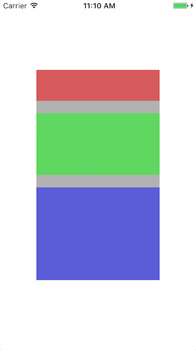
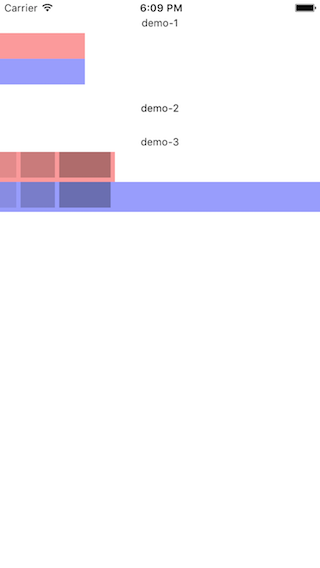
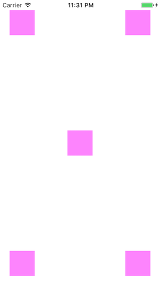
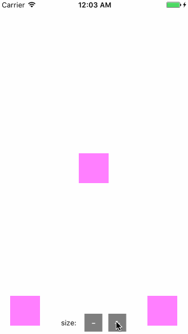
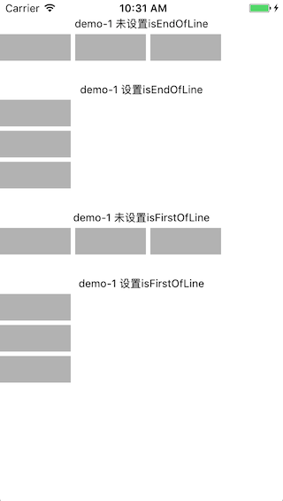
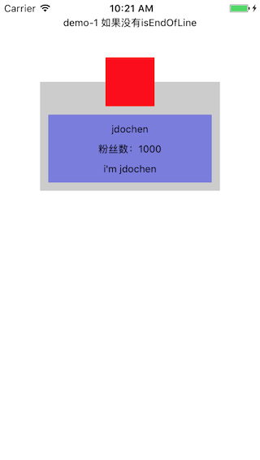

# 流体布局的使用

## 简介：

> iOS原有的排版方式就好比贴纸画一样，这样的方式相对灵活，但往往开发者需要关心每个素材的位置、大小，如果涉及到相对位置排版（比如狮子要在青蛙的右边且距离xx个像素），开发者还需关注哪些素材与哪些素材相关联。

<kbd></kdb>

> 而流体布局就好比积木一样，先有基底才有塔峰；哪些素材排在同一层？哪些素材排在新的一层？这些完全由织梦者去选择不同的素材来决定，你可以选择长一点的木块放到新的一层也可以选择多个短一点的木块凑在同一层；流体布局也一样，从上往下，从左到右的排下来，开发者不需要再关心每一个素材的独立位置，开发者只需定义这个素材的类型（block或者inline），也不需要指定素材与素材直接的相对排版关系。

<kbd></kdb>

## 大纲
* [`ALEngine`内置view](#内置view)
  * [ALView](#alview)
  * [ALLabel](#allabel)

* [排版属性](#排版属性)
  * [position](#position---view的布局方式)
  * [display](#display---流体布局view的排版类型)
  * [contentAlign](#contentalign---指定流体布局的水平对齐方向)
* [样式属性](#样式属性)
  * [尺寸类](#尺寸类---尺寸类属性主要用于指定view的大小)
    * size
    * width
    * height
    * maxWidth
    * maxHeight
  * [位置类](#位置类---位置类属性主要用于指定view的相对排版位置)
    * origin
    * top
    * left
    * right
    * bottom
    * center
    * centerX
    * centerY
  * [外边距类](#外边距类---主要用于设置view与view之间的间隔)
    * margin
    * marginTop
    * marginLeft
    * marginRight
    * marginBottom
  * [内边距类](#内边距类---主要用于allabel设置文字与view之间的间隔)
    * paddingTop
    * paddingLeft
    * paddingRight
    * paddingBottom
* [其他属性](#其他属性)
  * [isEngOfLine](#bool-isendofline)
  * [isFirstOfLine](#bool-isfirstofline)
  * [hidden](#bool-hidden)

## 内置view

### ALView

`ALView`是`ALEngine`提供的最基本的view，它继承于`UIView`，没有任何内置的排版属性（后面会详细讲解到排版属性），完全由开发者去指定。

### ALLabel

`ALLabel`继承于`UILabel`，默认是`inline`类型的的view，具有自动更新自身size的能力。

## 排版属性

### position - view的布局方式

这是初始化一个ALView必须要指定的第一个属性；它定义了view的布局方式，ALEngine提供了`relative`与`absolute`两种方式。

#### 取值：

* **ALPositionRelative - 相对布局 [默认]**：又称流体布局，根据view自身的展示类型（display）以及上一兄弟view的展示类型自动做相对位置的排版
* **ALPositionAbsolute - 绝对布局**：绝对布局类似iOS原生的布局但不同于原生的布局，绝对布局最基本的特征就是这类view脱离它们原本所属的流体，不再与流体布局中的view相关联；所以绝对布局的view是需要设置`top` `left` `right` `bottom` `centerX` `centerY`来设置它们的位置，绝对布局自身虽然脱离了它所属的流（所在的父view的流），但它可以包含流体布局的view。

#### 用法
##### 标准的用法
```objective-c
// 初始化一个ALView
ALView * view = [[ALView alloc] init];
// 通过style.position指定该view的布局方式，如果你不指定则默认为ALPositionRelative
view.style.position = ALPositionAbsolute;
```

##### 快捷的用法
```objective-c
// 初始化一个absolute方式布局的view
ALView * view = [ALView newAbsoluteView];
// or
ALView * view = [[ALView alloc] initAbsoluteView];
// 初始化一个relative方式布局的view
ALView * view = [ALView new];
// or
ALView * view = [[ALView alloc] init];
```

#### DEMO - 1 - 1

##### code
```objective-c
// 定义一个relative方式布局的body
ALView * body = [ALView new];
body.backgroundColor = [UIColor colorWithRed:0 green:0 blue:0 alpha:0.1];
[body addTo: self.view];

// 定义一个relative方式布局的section1，并将其添加到body中
ALView * section1 = [ALView new];
section1.style.height = 50;
// 设置view的外边距
section1.style.marginTop = 20;
section1.backgroundColor = [UIColor colorWithRed:1 green:0 blue:0 alpha:0.5];
[section1 addTo: body];

// 定义一个relative方式布局的section2，并将其添加到body中
ALView * section2 = [ALView new];
section2.style.height = 100;
section2.style.marginTop = 20;
section2.backgroundColor = [UIColor colorWithRed:1 green:1 blue:0 alpha:0.5];
[section2 addTo: body];

// 定义一个relative方式布局的section3，并将其添加到body中
ALView * section3 = [ALView new];
section3.style.height = 150;
section3.style.margin = (ALRect) {20, 0, 20, 0};
section3.backgroundColor = [UIColor colorWithRed:0 green:0 blue:1 alpha:0.5];
[section3 addTo: body];

// 定义一个absolute方式布局的absView，并将其添加到body中
ALView * absView = [ALView newAbsoluteView];
// 设置view的大小
absView.style.size = (CGSize) {80, 80};
// 设置view相对父view垂直水平居中
absView.style.center = (CGPoint) {0, 0};
absView.backgroundColor = [UIColor colorWithRed:1 green:1 blue:1 alpha:0.7];
[absView addTo: body];
```
##### 效果预览
<kbd></kbd>

##### DEMO分析
大概解释一下代码：
1. 新建一个`relative`方式布局的body，并将它添加到self.view当中；
2. 新建三个`relative`方式布局的section，并将它们添加到body当中；
3. 新建一个`absolute`方式布局的absView，并将它添加到body当中；
最终的效果在我的设想内，`relative`方式布局的view会根据自身的展示类型（`display`，下一个属性会讲到）以及上一个view的展示类型来做相对位置的自动排版；而`absolute`方式布局的view则会脱离这套流体的约束，通过指定的位置信息（`top` `left` `right` `bottom` `centerX` `centerY`）来相对父view布局

注：在上面的demo当中，细心的童鞋应该还可以发现两个点：
1. 我并没有给body设置高度，但最后body的高度却被relative方式布局的子view撑开了
2. 我也并没有给section设置宽度，但最后他们的宽度都自动等于父view的宽度
这两个特征我会在下一个属性`display`讲到。

#### DEMO - 1 - 2

##### code
```objective-c
// 在上面的代码基础上，动态更改section2的高度
section2.style.height += 5;
// 或者
section2.style.height -= 5;
```

##### 效果预览
<kbd></kbd>

##### DEMO分析
可以看到当section2的高度发生改变时，有以下相关联的view发生了重排：
1. 下一个兄弟view section3的位置发生了重排；
2. 父view body的高度也发生了重排；
3. 由于父view高度发生了重排导致父view中使用了`absolute`方式布局且是居中定位的子view absView也发生了位置重排。

由此看来`absolute`方式排版的view虽然脱离的流体排版的影响，但还保留了动态更新布局的能力（这点是有别与iOS原生的布局）

#### DEMO - 1 - 3
##### code
```objective-c
// 定义一个absolute方式布局的body
ALView * body = [ALView newAbsoluteView];
// 设置body相对父view垂直水平居中
body.style.center = (CGPoint) {0, 0};
body.backgroundColor = [UIColor colorWithRed:0 green:0 blue:0 alpha:0.3];
[body addTo: self.view];

// 定义一个relative方式布局的section1，并将其添加到body中
ALView * section1 = [ALView new];
// 设置view的尺寸
section1.style.size = (CGSize) {200, 50};
section1.backgroundColor = [UIColor colorWithRed:1 green:0 blue:0 alpha:0.5];
[section1 addTo: body];

// 定义一个relative方式布局的section2，并将其添加到body中
ALView * section2 = [ALView new];
section2.style.size = (CGSize) {200, 100};
// 设置view的上下外边距
section2.style.margin = (ALRect) {20, 0, 20, 0};
section2.backgroundColor = [UIColor colorWithRed:0 green:1 blue:0 alpha:0.5];
[section2 addTo: body];

// 定义一个relative方式布局的section3，并将其添加到body中
ALView * section3 = [ALView new];
section3.style.size = (CGSize) {200, 150};
section3.backgroundColor = [UIColor colorWithRed:0 green:0 blue:1 alpha:0.5];
[section3 addTo: body];
```
##### 效果预览
<kbd></kbd>

##### DEMO分析
代码还是很简单：初始化三个使用了relative方式布局的section并添加到了使用absolute方式布局的body中，但这里有两个点是我想单独提出来说的：
1. 我仅仅是指定了body的位置（相对父view垂直水平居中），并没有设置它的尺寸，从预览中我们可以看得出body的宽高同样也被子view撑开了，这也是absolute方式布局与原始iOS的区别之一，具有自动的宽高能力；
2. 基于第一点的自动宽高特征之后，我们再回顾下iOS原生的排版：当你计算好一个view是居中展示的，而该view的size发生变更时都需要重新计算一次该view的origin以保证该view还是居中；那么absolute方式布局区别于iOS原生的方式还有另一特征，那就是自动维持最初设置好的位置。
下面我们再来演示一个更直观的例子：
#### DEMO - 1 - 4
##### code
```objective-c
// 在上面的代码基础上，动态更改section2的高度
section2.style.height += 5;
// 或者
section2.style.height -= 5;
```

##### 效果预览
<kbd></kbd>


### display - 流体布局view的排版类型

这是初始化一个relative排版方式的ALView必须要指定的第一个属性；它定义了view的排版类型，ALEngine提供了两种展示类型：`块级（block）`、`行内（inline）`，这两种类型最大的区别就是：block是固定断行排版，而inline则是自动断行排版。这里涉及到的固定与自动也是非常好理解，后面我会详细讲到。

** 注：该属性只针对relative方式布局的view生效。 **

#### 取值：

* **ALDisplayBlock - 块级布局 [默认]**：block定义了这个view是固定断行排版，固定断行包含两个层面：1、无论该view的上一个兄弟节点view（previous sibling view）是inline还是block，该view都以新的一行展示；2、如果上一个兄弟节点view是block，那它的下一个view不管是block还是inline也都以新的一行展示。
* **ALDisplayInline - 行内布局**：inline定义的view是自动换行，简单的理解就是：当父view宽度能够安放的下该view时，那就紧挨着上一个兄弟view的右侧排版，否者就以新的一行进行排版；当然还有一些小规则会影响断行，后面会通过demo演示。

#### 用法
##### 标准的用法
```objective-c
// 初始化一个ALView
ALView * view = [[ALView alloc] init];
// 通过style.display指定该view的流体的排版类型，如果你不指定则默认为ALDisplayBlock
view.style.display = ALDisplayInline;
```

##### 快捷的用法
```objective-c
// 初始化一个inline方式布局的流体view
ALView * view = [ALView newInlineView];
// or
ALView * view = [[ALView alloc] initInlineView];
// 初始化一个block方式布局的流体view
ALView * view = [ALView new];
// or
ALView * view = [[ALView alloc] init];
```
#### DEMO - 2 - 1

##### code
```objective-c
ALView * block1 = [ALView new];
block1.style.height = 50;
block1.backgroundColor = [UIColor colorWithRed:1 green:0 blue:0 alpha:0.5];
block1.style.margin = (ALRect) {20, 0, 10, 0};
[block1 addTo: self.view];

ALView * block2 = [ALView new];
block2.style.size = (CGSize) {100, 50};
block2.backgroundColor = [UIColor colorWithRed:0 green:1 blue:0 alpha:0.5];
block2.style.marginBottom = 10;
[block2 addTo: self.view];

// 初始化inline view并添加到self.view中
[[self createInlineViewWidth:50 height:50 alpha:0.1] addTo: self.view];
[[self createInlineViewWidth:100 height:50 alpha:0.2] addTo: self.view];
[[self createInlineViewWidth:150 height:50 alpha:0.3] addTo: self.view];
[[self createInlineViewWidth:200 height:50 alpha:0.4] addTo: self.view];

ALView * block3 = [ALView new];
block3.style.size = (CGSize) {120, 100};
block3.backgroundColor = [UIColor colorWithRed:0 green:0 blue:1 alpha:0.5];
block3.style.marginBottom = 10;
[block3 addTo: self.view];

ALView * block4 = [ALView new];
block4.style.size = (CGSize) {80, 40};
block4.backgroundColor = [UIColor colorWithRed:1 green:1 blue:0 alpha:0.5];
[block4 addTo: self.view];

// 辅助方法
- (ALView *) createInlineViewWidth: (CGFloat) width height: (CGFloat) height alpha: (CGFloat) alpha
{
    ALView * inlineView = [ALView newInlineView];
    inlineView.style.margin = (ALRect){0, 5, 5, 0};
    if ( height ) {
        inlineView.style.height = height;
    }
    if ( width ) {
        inlineView.style.width = width;
    }
    inlineView.backgroundColor = [UIColor colorWithRed:0 green:0 blue:0 alpha:alpha];
    return inlineView;
}
```
##### 效果预览
<kbd></kbd>

##### DEMO分析
从上面的demo我们能明显看到block与inline最基本的区别与特征：
1. block1没有指定width值，那它默认是父view的宽度；
2. 遇到block或者自己是block，那一定是排在新的一行；
3. inline会根据行宽自动判别是否应该断行。
下面再看一个demo，可以充分感受到流体布局中inline与block的特征

#### DEMO - 2 - 2

##### 效果预览
<kbd></kbd>

##### DEMO分析

上面demo的代码很简单，我就不展示代码了，基本跟[demo-2-1]一致，只不过增加了一个纯红色的inline类型view (inlView)，并添加在第一个inline view之前；当改变inlView的width时就会触发相关联的流体布局view发生相应的自动排版。

### contentAlign - 指定流体布局的水平对齐方向

这是初始化一个relative排版方式的ALView必须要指定的第二个属性；我们都知道UILabel中有一个属性叫`textAlignment`，这个属性指定了固定宽度下UILabel内部的文字水平对齐方式，contentAlign也类似textAlignment，但是contentAlign是用于指定子view的水平对齐方式。

** 注：该属性只针对relative方式布局的view生效。 **

#### 取值：

* **ALContentAlignLeft - 水平左对齐 [默认]**：指定使用了流体排版的子view左对齐排版
* **ALContentAlignCenter - 水平居中对齐**：指定使用了流体排版的子view居中对齐排版
* **ALContentAlignRight - 水平右对齐**：指定使用了流体排版的子view右对齐排版

#### DEMO - 3 - 1

##### code
```objective-c
ALView * article1 = [[ALView alloc] init];
article1.style.margin = (ALRect) {20, 0, 20, 0};
// ALContentAlignLeft可以不用写，因为默认就是ALContentAlignLeft
article1.style.contentAlign = ALContentAlignLeft;
article1.backgroundColor = [UIColor colorWithRed:0 green:0 blue:0 alpha:0.1];
[article1 addTo: body];

ALView * sub1 = [[ALView alloc] init];
sub1.style.size = (CGSize) {150, 100};
sub1.backgroundColor = [UIColor yellowColor];
[sub1 addTo: article1];

ALView * article1 = [[ALView alloc] init];
article1.style.marginBottom = 20;
article1.style.contentAlign = ALContentAlignCenter;
article1.backgroundColor = [UIColor colorWithRed:0 green:0 blue:0 alpha:0.1];
[article1 addTo: body];

ALView * sub2 = [[ALView alloc] init];
sub2.style.size = (CGSize) {150, 100};
sub2.backgroundColor = [UIColor blueColor];
[sub2 addTo: article1];

ALView * article3 = [[ALView alloc] init];
article3.style.marginBottom = 20;
article3.style.contentAlign = ALContentAlignRight;
article3.backgroundColor = [UIColor colorWithRed:0 green:0 blue:0 alpha:0.1];
[article3 addTo: body];

ALView * sub3 = [[ALView alloc] init];
sub3.style.size = (CGSize) {150, 100};
sub3.backgroundColor = [UIColor redColor];
[sub3 addTo: article3];
```
##### 效果预览
<kbd></kbd>

##### DEMO分析

这个demo很简单，分别初始化三个article，并初始化三个sub分别添加到article中，然后分别设置article的contentAlign为`ALContentAlignLeft` `ALContentAlignCenter` `ALContentAlignRight`，然后看看它们的子view排版效果。

#### DEMO - 3 - 2

##### code
```objective-c
ALView * article1 = [[ALView alloc] init];
article1.style.margin = (ALRect){20, 0, 20, 0};
// ALContentAlignLeft可以不用写，因为默认就是ALContentAlignLeft
article1.style.contentAlign = ALContentAlignLeft;
article1.backgroundColor = [UIColor colorWithRed:0 green:0 blue:0 alpha:0.1];
[article1 addTo: body];

[[self createInlineBox1:0.1] addTo:article1];
[[self createInlineBox1:0.2] addTo:article1];
[[self createInlineBox1:0.3] addTo:article1];
[[self createInlineBox1:0.4] addTo:article1];

ALView * article2 = [[ALView alloc] init];
article2.style.marginBottom = 20;
article2.style.contentAlign = ALContentAlignCenter;
article2.backgroundColor = [UIColor colorWithRed:0 green:0 blue:0 alpha:0.1];
[article2 addTo: body];

[[self createInlineBox1:0.1] addTo:article2];
[[self createInlineBox1:0.2] addTo:article2];
[[self createInlineBox1:0.3] addTo:article2];
[[self createInlineBox1:0.4] addTo:article2];

ALView * article3 = [[ALView alloc] init];
article3.style.contentAlign = ALContentAlignRight;
article3.backgroundColor = [UIColor colorWithRed:0 green:0 blue:0 alpha:0.1];
[article3 addTo: body];

[[self createInlineBox1:0.1] addTo:article3];
[[self createInlineBox1:0.2] addTo:article3];
[[self createInlineBox1:0.3] addTo:article3];
[[self createInlineBox1:0.4] addTo:article3];

// 辅助方法
- (ALView *) createInlineBox1: (CGFloat) alpha
{
    ALView * view = [ALView newInlineView];
    view.style.size = (CGSize) {40, 50};
    view.style.margin = (ALRect) {10, 10, 10, 10};
    view.backgroundColor = [UIColor colorWithRed:0 green:0 blue:0 alpha:alpha];
    return view;
}
```
##### 效果预览
<kbd></kbd>

##### DEMO分析
这个demo也非常简单，主要演示了存在多个inline类型子view的情况下，`ALContentAlignLeft` `ALContentAlignCenter` `ALContentAlignRight`的表现。

#### DEMO - 3 - 3

##### code
```objective-c
ALView * article1 = [[ALView alloc] init];
article1.style.margin = (ALRect){20, 0, 20, 0};
// ALContentAlignLeft可以不用写，因为默认就是ALContentAlignLeft
article1.style.contentAlign = ALContentAlignLeft;
article1.backgroundColor = [UIColor colorWithRed:0 green:0 blue:0 alpha:0.1];
[article1 addTo: self.view];

[[self createInlineViewWidth:100 height:50 alpha:0.2] addTo:article1];
[[self createBlockViewWidth:200 height:80 alpha:0.3] addTo: article1];
[[self createAbsoluteViewWidth: 40 height:40 alpha:0.5] addTo:article1];

ALView * article2 = [[ALView alloc] init];
article2.style.marginBottom = 20;
article2.style.contentAlign = ALContentAlignCenter;
article2.backgroundColor = [UIColor colorWithRed:0 green:0 blue:0 alpha:0.1];
[article2 addTo: self.view];

[[self createInlineViewWidth:100 height:50 alpha:0.2] addTo:article2];
[[self createBlockViewWidth:200 height:80 alpha:0.3] addTo: article2];
[[self createAbsoluteViewWidth: 40 height:40 alpha:0.5] addTo:article2];

ALView * article3 = [[ALView alloc] init];
article3.style.contentAlign = ALContentAlignRight;
article3.backgroundColor = [UIColor colorWithRed:0 green:0 blue:0 alpha:0.1];
[article3 addTo: self.view];

[[self createInlineViewWidth:100 height:50 alpha:0.2] addTo:article3];
[[self createBlockViewWidth:200 height:80 alpha:0.3] addTo: article3];
[[self createAbsoluteViewWidth: 40 height:40 alpha:0.5] addTo:article3];

- (ALView *) createInlineViewWidth: (CGFloat) width height: (CGFloat) height alpha: (CGFloat) alpha
{
    ALView * view = [ALView newInlineView];
    view.style.margin = (ALRect){0, 5, 5, 0};
    if ( height ) {
        view.style.height = height;
    }
    if ( width ) {
        view.style.width = width;
    }
    view.backgroundColor = [UIColor colorWithRed:0 green:0 blue:0 alpha:alpha];
    return view;
}

// 辅助方法
- (ALView *) createBlockViewWidth: (CGFloat) width height: (CGFloat) height alpha: (CGFloat) alpha
{
    ALView * view = [[ALView alloc] init];
    view.style.margin = (ALRect) {0, 0, 5, 5};
    if ( height ) {
        view.style.height = height;
    }
    if ( width ) {
        view.style.width = width;
    }
    view.backgroundColor = [UIColor colorWithRed:1 green:0 blue:0 alpha:alpha];
    return view;
}

- (ALView *) createAbsoluteViewWidth: (CGFloat) width height: (CGFloat) height alpha: (CGFloat) alpha
{
    ALView * view = [ALView newAbsoluteView];
    view.style.center = (CGPoint) {0, 0};
    if ( height ) {
        view.style.height = height;
    }
    if ( width ) {
        view.style.width = width;
    }
    view.backgroundColor = [UIColor colorWithRed:1 green:1 blue:0 alpha:alpha];
    return view;
}
```
##### 效果预览
<kbd></kbd>

##### DEMO分析
这里主要演示的是混合了block与inline类型的子view，以及使用了`absolute`方式布局的子view；从效果可以明显看出contentAlign只对流体(relative)布局的子view有作用。

## 样式属性

### 尺寸类 - 尺寸类属性主要用于指定view的大小

ALEngine提供了这些跟尺寸相关的属性：`width` `height` `maxWidth` `maxHeight`，其中`size`是简写；在之前的demo我们也有演示过关于`width` `height`属性，下面我再用一个demo总结一下。

#### DEMO - 4 - 1

##### code
```objective-c
[[self createTitleViewWith: @"demo-1"] addTo: self.view];
ALView * inlView1 = [ALView newInlineView];
inlView1.style.size = (CGSize) {100, 30};
inlView1.backgroundColor = [UIColor colorWithRed:1 green:0 blue:0 alpha:0.4];
[inlView1 addTo: self.view];

ALView * blkView1 = [ALView new];
blkView1.style.size = (CGSize) {100, 30};
blkView1.backgroundColor = [UIColor colorWithRed:0 green:0 blue:1 alpha:0.4];
[blkView1 addTo: self.view];

[[self createTitleViewWith: @"demo-2"] addTo: self.view];
ALView * inlView2 = [ALView newInlineView];
inlView2.backgroundColor = [UIColor colorWithRed:1 green:0 blue:0 alpha:0.4];
[inlView2 addTo: self.view];

ALView * blkView2 = [ALView new];
blkView2.backgroundColor = [UIColor colorWithRed:0 green:0 blue:1 alpha:0.4];
[blkView2 addTo: self.view];

[[self createTitleViewWith: @"demo-3"] addTo: self.view];
ALView * inlView3 = [ALView newInlineView];
inlView3.backgroundColor = [UIColor colorWithRed:1 green:0 blue:0 alpha:0.4];
[inlView3 addTo: self.view];

[[self createInlineViewWidth:20 height:30 alpha:0.1] addTo:inlView3];
[[self createInlineViewWidth:40 height:30 alpha:0.2] addTo:inlView3];
[[self createInlineViewWidth:60 height:30 alpha:0.3] addTo:inlView3];

ALView * blkView3 = [ALView new];
blkView3.backgroundColor = [UIColor colorWithRed:0 green:0 blue:1 alpha:0.4];
[blkView3 addTo: self.view];
[[self createInlineViewWidth:20 height:30 alpha:0.1] addTo:blkView3];
[[self createInlineViewWidth:40 height:30 alpha:0.2] addTo:blkView3];
[[self createInlineViewWidth:60 height:30 alpha:0.3] addTo:blkView3];

// 辅助方法
- (ALView *) createInlineViewWidth: (CGFloat) width height: (CGFloat) height alpha: (CGFloat) alpha
{
    ALView * view = [ALView newInlineView];
    view.style.margin = (ALRect){0, 5, 5, 0};
    if ( height ) {
        view.style.height = height;
    }
    if ( width ) {
        view.style.width = width;
    }
    view.backgroundColor = [UIColor colorWithRed:0 green:0 blue:0 alpha:alpha];
    return view;
}
- (ALView *) createTitleViewWith: (NSString *) tx
{
    ALView * wrap = [ALView new];
    wrap.style.margin = (ALRect) {20, 0, 5, 0};
    wrap.style.contentAlign = ALContentAlignCenter;
    ALLabel * title = [ALLabel new];
    title.text = tx;
    title.font = [UIFont systemFontOfSize:12];
    [title addTo: wrap];
    return wrap;
}
```

##### 效果预览
<kbd></kbd>

##### DEMO分析
这里我整合了3个demo，每个demo中都包含一个inline与block类型的view，主要用于展示`width`属性在流体布局的view上的特征：
* demo-1，这是最普通的用法，分别给block与inline类型的view设置了固定的宽高，实际的排版就会按照设置的值来布局；
* demo-2，在这个代码中，我同时去掉宽高的设置，可以看出两中类型的view都不见；那是不是默认都为0呢？我们继续看demo-3；
* demo-3，创建三个子view分别添加进去，可以看出：inline类型的view的宽高完全被子view撑开了，而block类型的view高度也由子view撑开了，但宽度却为父view的宽度；

1. 对于inline类型的view
  * 如果没有设置height则默认height为0，并且会随着子view的最新高度而更新自身的高度，最大不超过父view的固定高度；
  * 如果没有设置width则默认width为0，并且会随着子view的最新宽度而更新自身的宽度，最大不超过父view的固定宽度；
2. 对于block类型的view
  * 如果没有设置height则默认height为0，并且会随着子view的最新高度而更新自身的高度（同inline）；
  * 如果没有设置width则默认width为父view的宽度；
3. 对于absolute排版的view，规则跟inline类型一致。

除了通用的width与height属性，`ALEngine`还提供了`maxWidth` `maxHeight`能力，下面[demo-4-2]会展示这两个属性的用处。

#### DEMO - 4 - 2

##### code
```objective-c
[[self createTitleViewWith: @"demo-1 子view未超200"] addTo: self.view];
ALView * inlView1 = [ALView newInlineView];
inlView1.style.maxWidth = 200;
inlView1.backgroundColor = [UIColor colorWithRed:1 green:0 blue:0 alpha:0.4];
[inlView1 addTo: self.view];

[[self createInlineViewWidth:20 height:30 alpha:0.1] addTo:inlView1];
[[self createInlineViewWidth:40 height:30 alpha:0.2] addTo:inlView1];
[[self createInlineViewWidth:60 height:30 alpha:0.3] addTo:inlView1];

[[self createTitleViewWith: @"demo-2 子view超过200"] addTo: self.view];
ALView * inlView2 = [ALView newInlineView];
inlView2.style.maxWidth = 200;
inlView2.backgroundColor = [UIColor colorWithRed:1 green:0 blue:0 alpha:0.4];
[inlView2 addTo: self.view];

[[self createInlineViewWidth:20 height:30 alpha:0.1] addTo:inlView2];
[[self createInlineViewWidth:40 height:30 alpha:0.2] addTo:inlView2];
[[self createInlineViewWidth:60 height:30 alpha:0.3] addTo:inlView2];
[[self createInlineViewWidth:50 height:30 alpha:0.4] addTo:inlView2];
[[self createInlineViewWidth:100 height:30 alpha:0.5] addTo:inlView2];
[[self createInlineViewWidth:30 height:30 alpha:0.6] addTo:inlView2];
// 辅助方法
- (ALView *) createInlineViewWidth: (CGFloat) width height: (CGFloat) height alpha: (CGFloat) alpha
{
    ALView * view = [ALView newInlineView];
    view.style.margin = (ALRect){0, 5, 5, 0};
    if ( height ) {
        view.style.height = height;
    }
    if ( width ) {
        view.style.width = width;
    }
    view.backgroundColor = [UIColor colorWithRed:0 green:0 blue:0 alpha:alpha];
    return view;
}
```
##### 效果预览
<kbd></kbd>
##### DEMO分析
`maxWidth` `maxHeight`的应用场景很丰富，但这里有两点需要注意的：
1. `maxWidth` `maxHeight`仅在`width` `height`未指定的情况生效；
2. `maxWidth`对block类型的view不起作用的，因为block类型在没设置width属性的情况下默认为父view的宽度，换句话说也就是ALEngine已经帮你设置了width属性；

### 位置类 - 位置类属性主要用于指定view的相对排版位置

ALEngine提供了这些跟尺寸相关的属性：`top` `left` `right` `bottom`，其中`origin`是简写；还有`centerX` `centerY`，其中`center`是简写。位置相关的属性有些类似于iOS原生的排版方式（贴花），但却比原生的排版更加便利，下面我会用demo逐个讲到。
**注：位置类属性只对`absolute`方式排版的view生效，因为`relative`方式排版的view是会跟着所属的流体自动布局，如果你希望控制view与view直接的间隔，你可以通过`margin`去设置，下一个属性会讲到。**

#### DEMO - 4 - 1

##### code
```objective-c
// 左上角
[[self createAbsViewWithOrigin: (ALRect) {20, 0, 0, 20}] addTo: self.view];
// 右上角
[[self createAbsViewWithOrigin: (ALRect) {20, 20, 0, 0}] addTo: self.view];
// 左下角
[[self createAbsViewWithOrigin: (ALRect) {0, 0, 20, 20}] addTo: self.view];
// 右下角
[[self createAbsViewWithOrigin: (ALRect) {0, 20, 20, 0}] addTo: self.view];
// 居中
[[self createAbsViewWithCenter: (CGPoint) {0, 0}] addTo: self.view];

// 辅助方法
- (ALView *) createAbsViewWithCenter: (CGPoint) center
{
    ALView * view = [ALView newAbsoluteView];
    view.style.center = center;
    view.style.size = (CGSize) {50, 50};
    view.backgroundColor = [UIColor colorWithRed:1 green:0 blue:1 alpha:0.5];
    return view;
}

- (ALView *) createAbsViewWithOrigin: (ALRect) origin
{
    ALView * view = [ALView newAbsoluteView];
    view.style.origin = origin;
    view.style.size = (CGSize) {50, 50};
    view.backgroundColor = [UIColor colorWithRed:1 green:0 blue:1 alpha:0.5];
    return view;
}
```
##### 效果预览
<kbd></kbd>
##### DEMO分析
demo代码很简单，初始化五个`absolute`方式排版的view，分别相对父view来做左上角、右上角、左下角、右下角、居中排版；虽然简单，但有几个点我还是有必要在这里强调一下：
1. `top`是上边相对父view上边的距离，`left`是左边相对父view左边的距离；这个与iOS原生的排版一致；
2. 除此之外，`ALEngine`还提供了，`bottom` `right`，其中`bottom`是底边相对父view底边的距离 `right`是右边相对父view右边的距离；
3. `ALEngine`提供的`center`排版则完全不同于iOS原生的center，`center`是中心相对于父view中心的距离的偏移，{0,0}则表示垂直水平居中；
4. **这些不同的排版方式在优先级方式是：left > centerX > right; top > centerY > bottom; 举个例子：如果你同时设置了left与right，那就只有left生效。**
`ALEngine`不仅提供了较便利的位置排版方式，还提供了另一动态更新的能力，让排版不会因为自身的尺寸发生变化而变化，下面看个demo就能很好理解这一点

#### DEMO - 5 - 2

##### code
```objective-c
// 左下角
[[self createAbsViewWithOrigin: (ALRect) {0, 0, 20, 20}] addTo: self.view];
// 右下角
[[self createAbsViewWithOrigin: (ALRect) {0, 20, 20, 0}] addTo: self.view];
// 居中
[[self createAbsViewWithCenter: (CGPoint) {0, 0}] addTo:self.view];

// 辅助方法
- (ALView *) createAbsViewWithCenter: (CGPoint) center
{
    ALView * view = [ALView newAbsoluteView];
    view.style.center = center;
    view.style.size = (CGSize) {50, 50};
    view.backgroundColor = [UIColor colorWithRed:1 green:0 blue:1 alpha:0.5];
    return view;
}

- (ALView *) createAbsViewWithOrigin: (ALRect) origin
{
    ALView * view = [ALView newAbsoluteView];
    view.style.origin = origin;
    view.style.size = (CGSize) {50, 50};
    view.backgroundColor = [UIColor colorWithRed:1 green:0 blue:1 alpha:0.5];
    return view;
}
```

##### 效果预览
<kbd></kbd>

##### DEMO分析
代码很简单，初始化三个`absolute`方式排版的view，分别相对父view来是左下角、右下角、居中排版；当我改变这三个view的size时，从效果预览中可以看出它们依旧保持原样的排版位置，而这点是iOS原生排版没有提供的；平时我们遇到一些动态数据回来时总要重新计算了一遍view的origin，而使用`ALEngine`提供的方式则可以省去这部分时间与代码。


### 外边距类 - 主要用于设置view与view之间的间隔

外边距主要提供给`relative`方式排版的view使用，它可以让开发者设置流体布局中view与view之间的间隔，`ALEngine`提供了`marginTop` `marginLeft` `marginBottom` `marginRight`四个方向的边距可以控制，其中`margin`是简写。
**注：外边距只适用于`relative`方式排版的view。**

#### 用法
##### 标准的用法
```objective-c
// 初始化一个ALView
ALView * view = [ALView new];
view.style.size = (CGSize) {100, 100};
// 逐个方向设置
view.style.marginTop = 10;
view.style.marginLeft = 10;
view.style.marginBottom = 10;
view.style.marginRight = 10;
```

##### 快捷的用法
```objective-c
// 初始化一个inline方式布局的流体view
ALView * view = [ALView new];
// 简写
view.style.margin = (ALRect) {10, 10, 10, 10};
```

**注：`ALRect`是`ALEngine`定义的结构体，后面`padding`也会用到；含义是{top, right, bottom, left}，从top开始，顺时针旋转。**


### 内边距类 - 主要用于`ALLabel`设置文字与view之间的间隔

<!-- `ALLabel`是`ALEngine`提供的一种优化之后的UIView，它继承于`UILabel` -->
上面我们提到margin，主要用于撑开流体布局中的view与view之间的间距，但我们知道`UILabel`中文字与边界的间距是无法通过外边距来调整的，所以`ALEngine`提供内边距的主要是为了控制文字与view之间的空隙。

**注：外边距只适用于`ALLabel`类型的view**

#### 用法
##### 标准的用法
```objective-c
// 初始化一个ALView
ALLabel * view = [ALLabel new];
// 逐个方向设置
view.style.paddingTop = 10;
view.style.paddingLeft = 10;
view.style.paddingBottom = 10;
view.style.paddingRight = 10;
```

##### 快捷的用法
```objective-c
// 初始化一个inline方式布局的流体view
ALLabel * view = [ALLabel new];
// 简写
view.style.padding = (ALRect) {10, 10, 10, 10};
```

#### DEMO - 6 - 1

##### code
```objective-c
[[self createTitleViewWith: @"demo-1 未设置padding"] addTo: self.view];
[[self createALLabel:@"jdochen" padding:(ALRect){0,0,0,0}] addTo: self.view];
[[self createALLabel:@"jdochennnn" padding:(ALRect){0,0,0,0}] addTo: self.view];
[[self createALLabel:@"jdochennnnnn" padding:(ALRect){0,0,0,0}] addTo: self.view];

[[self createTitleViewWith: @"demo-2 设置padding=10"] addTo: self.view];
[[self createALLabel:@"jdochen" padding:(ALRect){10,10,10,10}] addTo: self.view];
[[self createALLabel:@"jdochennnn" padding:(ALRect){10,10,10,10}] addTo: self.view];
[[self createALLabel:@"jdochennnnnn" padding:(ALRect){10,10,10,10}] addTo: self.view];

[[self createTitleViewWith: @"demo-3 设置不同方向的padding"] addTo: self.view];
[[self createALLabel:@"jdochen" padding:(ALRect){10,20,10,0}] addTo: self.view];
[[self createALLabel:@"jdochennnn" padding:(ALRect){10,20,10,0}] addTo: self.view];
[[self createALLabel:@"jdochennnnnn" padding:(ALRect){10,20,10,0}] addTo: self.view];

// 辅助方法
- (ALLabel *) createALLabel: (NSString *) text padding: (ALRect) padding
{
    ALLabel * view = [[ALLabel alloc] init];
    view.text = text;
    view.style.margin = (ALRect) {2, 0, 0, 2};
    view.style.padding = padding;
    view.numberOfLines = 0;
    view.lineBreakMode = NSLineBreakByTruncatingTail;
    view.backgroundColor = [UIColor colorWithRed:1 green:0 blue:0 alpha:0.5];
    view.font = [UIFont systemFontOfSize:14.0];
    view.textColor = [UIColor whiteColor];
    return view;
}

- (ALView *) createTitleViewWith: (NSString *) tx
{
    ALView * wrap = [ALView new];
    wrap.style.margin = (ALRect) {20, 0, 5, 0};
    wrap.style.contentAlign = ALContentAlignCenter;
    ALLabel * title = [ALLabel new];
    title.text = tx;
    title.font = [UIFont systemFontOfSize:12];
    [title addTo: wrap];
    return wrap;
}
```

##### 效果预览
<kbd></kbd>

## 其他属性

### [BOOL] isEndOfLine

指定了view是所属行的最后一个view，`ALEngine`在遇到isEndOfLine=YES时，下一个view必定以新的一行排版。
**注：如果不设置isEndOfLine或者isEndOfLine=NO，则默认走自动断行逻辑，该断行时还是会断行**
**注：isEndOfLine只适用于`inline`类型的view，因为`block`本身就具有这样的特性。**

### [BOOL] isFirstOfLine

指定了view是所属行的第一个view，`ALEngine`在遇到isFirstOfLine=YES时，必定以新的一行排版该view。
**注：如果不设置isFirstOfLine或者isFirstOfLine=NO，则默认走自动断行逻辑，该断行时还是会断行**
**注：isFirstOfLine只适用于`inline`类型的view，因为`block`本身就具有这样的特性。**

#### DEMO - 7 - 1
```objective-c
[[self createTitleViewWith: @"demo-1 未设置isEndOfLine"] addTo: self.view];
[[self createInlineViewIsEndOfLine: NO] addTo: self.view];
[[self createInlineViewIsEndOfLine: NO] addTo: self.view];
[[self createInlineViewIsEndOfLine: NO] addTo: self.view];

[[self createTitleViewWith: @"demo-1 设置isEndOfLine"] addTo: self.view];
[[self createInlineViewIsEndOfLine: YES] addTo: self.view];
[[self createInlineViewIsEndOfLine: YES] addTo: self.view];
[[self createInlineViewIsEndOfLine: YES] addTo: self.view];


[[self createTitleViewWith: @"demo-1 未设置isFirstOfLine"] addTo: self.view];
[[self createInlineViewIsFirstOfLine: NO] addTo: self.view];
[[self createInlineViewIsFirstOfLine: NO] addTo: self.view];
[[self createInlineViewIsFirstOfLine: NO] addTo: self.view];

[[self createTitleViewWith: @"demo-1 设置isFirstOfLine"] addTo: self.view];
[[self createInlineViewIsFirstOfLine: YES] addTo: self.view];
[[self createInlineViewIsFirstOfLine: YES] addTo: self.view];
[[self createInlineViewIsFirstOfLine: YES] addTo: self.view];

// 辅助方法
- (ALView *) createTitleViewWith: (NSString *) tx
{
    ALView * wrap = [ALView new];
    wrap.style.margin = (ALRect) {20, 0, 5, 0};
    wrap.style.contentAlign = ALContentAlignCenter;
    ALLabel * title = [ALLabel new];
    title.text = tx;
    title.font = [UIFont systemFontOfSize:12];
    [title addTo: wrap];
    return wrap;
}

- (ALView *) createInlineViewIsEndOfLine: (BOOL) isEndOfLine
{
    ALView * view = [self createInlineViewWidth:80 height:30 alpha:0.3];
    view.style.isEndOFLine = isEndOfLine;
    return  view;
}

- (ALView *) createInlineViewIsFirstOfLine: (BOOL) isFirstOfLine
{
    ALView * view = [self createInlineViewWidth:80 height:30 alpha:0.3];
    view.style.isFirstOFLine = isFirstOfLine;
    return  view;
}

- (ALView *) createInlineViewWidth: (CGFloat) width height: (CGFloat) height alpha: (CGFloat) alpha
{
    ALView * view = [ALView newInlineView];
    view.style.margin = (ALRect){0, 5, 5, 0};
    if ( height ) {
        view.style.height = height;
    }
    if ( width ) {
        view.style.width = width;
    }
    view.backgroundColor = [UIColor colorWithRed:0 green:0 blue:0 alpha:alpha];
    return view;
}
```

#### 效果预览
<kbd></kbd>

每一样东西都有它存在的意义，`ALEngine`提供的`isEndOfLine`能力同样是为了弥补在某些场景的不足，下面我举一个demo来很好解释这一不足。

#### DEMO - 7 - 2

##### code
```objective-c
ALView * wrap = [ALView newAbsoluteView];
wrap.style.centerX = 0;
wrap.style.top = 100;
wrap.backgroundColor = [UIColor colorWithRed:0 green:0 blue:0 alpha:0.2];
[wrap addTo: self.view];

ALView * head = [ALView newAbsoluteView];
head.style.size = (CGSize) {60, 60};
head.style.centerX = 0;
head.style.top = -30;
head.backgroundColor = [UIColor redColor];
[head addTo: wrap];

ALView * main = [ALView new];
main.style.width = 200;
main.style.margin = (ALRect) {40, 10, 10, 10};
main.backgroundColor = [UIColor colorWithRed:0 green:0 blue:1 alpha:0.4];
[main addTo: wrap];

ALView * row1 = [ALView new];
row1.style.contentAlign = ALContentAlignCenter;
row1.style.margin = (ALRect) {10, 0, 10, 0};
[row1 addTo: main];

ALLabel * nick = [ALLabel new];
nick.text = @"jdochen";
nick.font = [UIFont systemFontOfSize:12];
[nick addTo: row1];

ALView * row2 = [ALView new];
row2.style.contentAlign = ALContentAlignCenter;
row2.style.marginBottom = 10;
[row2 addTo: main];

ALLabel * focus = [ALLabel new];
focus.text = @"粉丝数：1000";
focus.font = [UIFont systemFontOfSize:12];
[focus addTo: row2];

ALView * row3 = [ALView new];
row3.style.marginBottom = 10;
row3.style.contentAlign = ALContentAlignCenter;
[row3 addTo: main];

ALLabel * desc = [ALLabel new];
desc.text = @"i'm jdochen";
desc.font = [UIFont systemFontOfSize:12];
[desc addTo: row3];
```

##### 效果预览
<kbd></kbd>

##### DEMO分析
这是一个用户料卡的demo，而在这个资料卡中主要要讲的是个人信息的排版，因为用户数据是文本，所以必须用ALLabel承载，但ALLabel默认是`inline`类型的view，那也就意味着它是自动断行的，于是我不得不定义了`row1` `row2` `row3`来承载这些ALLabel以确保它们一定要在新的一行排版；但如果有了`isEndOfLine`这一能力，重结构上就可以减轻层级的嵌套，下面我们看看如何通过`isEndOfLine`来实现以上效果。

#### DEMO - 7 - 3

##### code
```objective-c
ALView * wrap = [ALView newAbsoluteView];
wrap.style.centerX = 0;
wrap.style.top = 100;
wrap.backgroundColor = [UIColor colorWithRed:0 green:0 blue:0 alpha:0.2];
[wrap addTo: self.view];

ALView * head = [ALView newAbsoluteView];
head.style.size = (CGSize) {60, 60};
head.style.centerX = 0;
head.style.top = -30;
head.backgroundColor = [UIColor redColor];
[head addTo: wrap];

ALView * main = [ALView new];
main.style.contentAlign = ALContentAlignCenter;
main.style.width = 200;
main.style.margin = (ALRect) {40, 10, 10, 10};
main.backgroundColor = [UIColor colorWithRed:0 green:0 blue:1 alpha:0.4];
[main addTo: wrap];

ALLabel * nick = [ALLabel new];
nick.style.isEndOFLine = YES;
nick.style.margin = (ALRect) {10, 0, 10, 0};
nick.text = @"jdochen";
nick.font = [UIFont systemFontOfSize:12];
[nick addTo: main];

ALLabel * focus = [ALLabel new];
focus.style.isEndOFLine = YES;
focus.style.marginBottom = 10;
focus.text = @"粉丝数：1000";
focus.font = [UIFont systemFontOfSize:12];
[focus addTo: main];

ALLabel * desc = [ALLabel new];
desc.style.isEndOFLine = YES;
desc.style.marginBottom = 10;
desc.text = @"i'm jdochen";
desc.font = [UIFont systemFontOfSize:12];
[desc addTo: main];
```

##### DEMO分析
从代码就看得出，我省去了`row1` `row2` `row3`的承载，减轻了view的层级嵌套，实际最终效果是一样的，我在这就不再展示预览效果了。`isFirstOfLine`的设定跟`isEndOFLine`一致，不过可以弥补一些`isEndOFLine`没法覆盖的场景，比如说：要设置`isEndOFLine=YES`的那个view是动态的（根据业务条件生成或不生成），这时候如果它下一个view是固定输出，那可以抛开业务条件，直接设置下一个view的`isFirstOfLine=YES`也能达到同样的效果。如果还有其他场景的应用那就需要大家一起去挖掘了。

### [BOOL] hidden

`ALEngine`也提供了类似iOS原生的`hidden`属性，你可以通过使用这个`hidden`来实现流体自有的排版规则，例如隐藏一个流体view，会触发相连的view重排。
