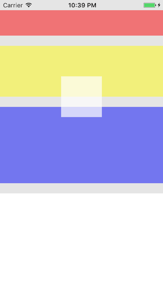
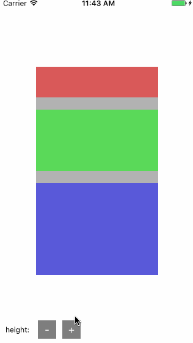
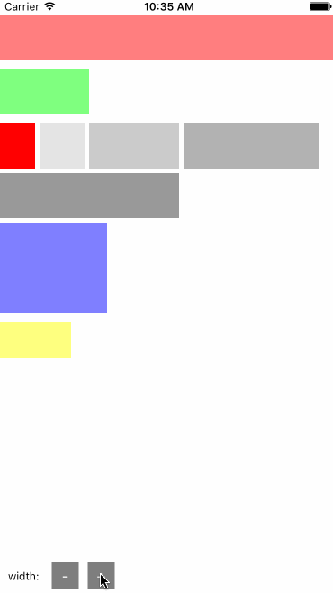
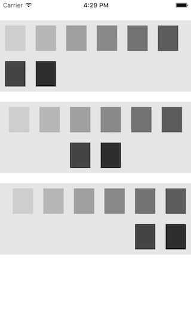
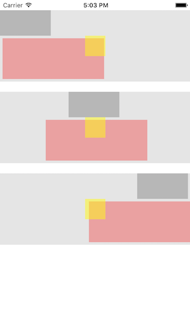

# 流体布局的使用

---

## 简介：

> iOS原有的排版方式就好比贴纸画一样，这样的方式相对灵活，但往往开发者需要关心每个素材的位置、大小，如果涉及到相对位置排版（比如狮子要在青蛙的右边且距离xx个像素），开发者还需关注哪些素材与哪些素材相关联。  

> 而流体布局就好比积木一样，先有基底才有塔峰；哪些素材排在同一层？哪些素材排在新的一层？这些完全由织梦者去选择不同的素材来决定，你可以选择长一点的木块放到新的一层也可以选择多个短一点的木块凑在同一层；流体布局也一样，从上往下，从左到右的排下来，开发者不需要再关心每一个素材的独立位置，开发者只需定义这个素材的类型（block或者inline），也不需要指定素材与素材直接的相对排版关系。

<div style="text-align: center">
	
	
</div>

## 排版属性

### position - view的布局方式

这是初始化一个ALView必须要指定的第一个属性；它定义了view的布局方式，ALEngine提供了`relative`与`absolute`两种方式。

#### 取值：

* **ALPositionRelative - 相对布局 [默认]**：又称流体布局，根据view自身的展示类型（display）以及上一兄弟view的展示类型自动做相对位置的排版
* **ALPositionAbsolute - 绝对布局**：绝对布局类似iOS原生的布局但不同于原生的布局，绝对布局最基本的特征就是这类view脱离它们原本所属的流体，不再与流体布局中的view相关联；所以绝对布局的view是需要设置`top` `left` `right` `bottom` `centerX` `centerY`来设置它们的位置，绝对布局自身虽然脱离了它所属的流（所在的父view的流），但它可以包含流体布局的view。

#### 用法
##### 标准的用法
```objective-c
// 初始化一个ALView
ALView * view = [[ALView alloc] init];
// 通过style.position指定该view的布局方式，如果你不指定则默认为ALPositionRelative
view.style.position = ALPositionAbsolute;
```

##### 快捷的用法
```objective-c
// 初始化一个absolute方式布局的view
ALView * view = [ALView newAbsoluteView];
// or
ALView * view = [[ALView alloc] initAbsoluteView];
// 初始化一个relative方式布局的view
ALView * view = [ALView new];
// or
ALView * view = [[ALView alloc] init];
```

#### DEMO - 1 - 1

##### code
```objective-c
// 定义一个relative方式布局的body
ALView * body = [ALView new];
body.backgroundColor = [UIColor colorWithRed:0 green:0 blue:0 alpha:0.1];
[body addTo: self.view];

// 定义一个relative方式布局的section1，并将其添加到body中
ALView * section1 = [ALView new];
section1.style.height = 50;
// 设置view的外边距
section1.style.marginTop = 20;
section1.backgroundColor = [UIColor colorWithRed:1 green:0 blue:0 alpha:0.5];
[section1 addTo: body];

// 定义一个relative方式布局的section2，并将其添加到body中
ALView * section2 = [ALView new];
section2.style.height = 100;
section2.style.marginTop = 20;
section2.backgroundColor = [UIColor colorWithRed:1 green:1 blue:0 alpha:0.5];
[section2 addTo: body];

// 定义一个relative方式布局的section3，并将其添加到body中
ALView * section3 = [ALView new];
section3.style.height = 150;
section3.style.margin = (ALRect) {20, 0, 20, 0};
section3.backgroundColor = [UIColor colorWithRed:0 green:0 blue:1 alpha:0.5];
[section3 addTo: body];

// 定义一个absolute方式布局的absView，并将其添加到body中
ALView * absView = [ALView newAbsoluteView];
// 设置view的大小
absView.style.size = (CGSize) {80, 80};
// 设置view相对父view垂直水平居中
absView.style.center = (CGPoint) {0, 0};
absView.backgroundColor = [UIColor colorWithRed:1 green:1 blue:1 alpha:0.7];
[absView addTo: body];
```
##### 效果预览


##### DEMO分析
大概解释一下代码：
1. 新建一个`relative`方式布局的body，并将它添加到self.view当中；
2. 新建三个`relative`方式布局的section，并将它们添加到body当中；
3. 新建一个`absolute`方式布局的absView，并将它添加到body当中；
最终的效果在我的设想内，`relative`方式布局的view会根据自身的展示类型（`display`，下一个属性会讲到）以及上一个view的展示类型来做相对位置的自动排版；而`absolute`方式布局的view则会脱离这套流体的约束，通过指定的位置信息（`top` `left` `right` `bottom` `centerX` `centerY`）来相对父view布局

注：在上面的demo当中，细心的童鞋应该还可以发现两个点：
1. 我并没有给body设置高度，但最后body的高度却被relative方式布局的子view撑开了
2. 我也并没有给section设置宽度，但最后他们的宽度都自动等于父view的宽度
这两个特征我会在下一个属性`display`讲到。

#### DEMO - 1 - 2

##### code
```objective-c
// 在上面的代码基础上，动态更改section2的高度
section2.style.height += 5;
// 或者
section2.style.height -= 5;
```

##### 效果预览


##### DEMO分析
可以看到当section2的高度发生改变时，有以下相关联的view发生了重排：
1. 下一个兄弟view section3的位置发生了重排；
2. 父view body的高度也发生了重排；
3. 由于父view高度发生了重排导致父view中使用了`absolute`方式布局且是居中定位的子view absView也发生了位置重排。

由此看来`absolute`方式排版的view虽然脱离的流体排版的影响，但还保留了动态更新布局的能力（这点是有别与iOS原生的布局）

#### DEMO - 1 - 3
##### code
```objective-c
// 定义一个absolute方式布局的body
ALView * body = [ALView newAbsoluteView];
// 设置body相对父view垂直水平居中
body.style.center = (CGPoint) {0, 0};
body.backgroundColor = [UIColor colorWithRed:0 green:0 blue:0 alpha:0.3];
[body addTo: self.view];

// 定义一个relative方式布局的section1，并将其添加到body中
ALView * section1 = [ALView new];
// 设置view的尺寸
section1.style.size = (CGSize) {200, 50};
section1.backgroundColor = [UIColor colorWithRed:1 green:0 blue:0 alpha:0.5];
[section1 addTo: body];

// 定义一个relative方式布局的section2，并将其添加到body中
ALView * section2 = [ALView new];
section2.style.size = (CGSize) {200, 100};
// 设置view的上下外边距
section2.style.margin = (ALRect) {20, 0, 20, 0};
section2.backgroundColor = [UIColor colorWithRed:0 green:1 blue:0 alpha:0.5];
[section2 addTo: body];

// 定义一个relative方式布局的section3，并将其添加到body中
ALView * section3 = [ALView new];
section3.style.size = (CGSize) {200, 150};
section3.backgroundColor = [UIColor colorWithRed:0 green:0 blue:1 alpha:0.5];
[section3 addTo: body];
```
##### 效果预览


##### DEMO分析
代码还是很简单：初始化三个使用了relative方式布局的section并添加到了使用absolute方式布局的body中，但这里有两个点是我想单独提出来说的：
1. 我仅仅是指定了body的位置（相对父view垂直水平居中），并没有设置它的尺寸，从预览中我们可以看得出body的宽高同样也被子view撑开了，这也是absolute方式布局与原始iOS的区别之一，具有自动的宽高能力；
2. 基于第一点的自动宽高特征之后，我们再回顾下iOS原生的排版：当你计算好一个view是居中展示的，而该view的size发生变更时都需要重新计算一次该view的origin以保证该view还是居中；那么absolute方式布局区别于iOS原生的方式还有另一特征，那就是自动维持最初设置好的位置。
下面我们再来演示一个更直观的例子：
#### DEMO - 1 - 4
##### code
```objective-c
// 在上面的代码基础上，动态更改section2的高度
section2.style.height += 5;
// 或者
section2.style.height -= 5;
```

##### 效果预览



### display - 流体布局view的排版类型

这是初始化一个relative排版方式的ALView必须要指定的第一个属性；它定义了view的排版类型，ALEngine提供了两种展示类型：`块级（block）`、`行内（inline）`，这两种类型最大的区别就是：block是固定断行排版，而inline则是自动断行排版。这里涉及到的固定与自动也是非常好理解，后面我会详细讲到。

** 注：该属性只针对relative方式布局的view生效。 **

#### 取值：

* **ALDisplayBlock - 块级布局 [默认]**：block定义了这个view是固定断行排版，固定断行包含两个层面：1、无论该view的上一个兄弟节点view（previous sibling view）是inline还是block，该view都以新的一行展示；2、如果上一个兄弟节点view是block，那它的下一个view不管是block还是inline也都以新的一行展示。
* **ALDisplayInline - 行内布局**：inline定义的view是自动换行，简单的理解就是：当父view宽度能够安放的下该view时，那就紧挨着上一个兄弟view的右侧排版，否者就以新的一行进行排版；当然还有一些小规则会影响断行，后面会通过demo演示。

#### 用法
##### 标准的用法
```objective-c
// 初始化一个ALView
ALView * view = [[ALView alloc] init];
// 通过style.display指定该view的流体的排版类型，如果你不指定则默认为ALDisplayBlock
view.style.display = ALDisplayInline;
```

##### 快捷的用法
```objective-c
// 初始化一个inline方式布局的流体view
ALView * view = [ALView newInlineView];
// or
ALView * view = [[ALView alloc] initInlineView];
// 初始化一个block方式布局的流体view
ALView * view = [ALView new];
// or
ALView * view = [[ALView alloc] init];
```
#### DEMO - 2 - 1

##### code
```objective-c
ALView * block1 = [ALView new];
block1.style.height = 50;
block1.backgroundColor = [UIColor colorWithRed:1 green:0 blue:0 alpha:0.5];
block1.style.margin = (ALRect) {20, 0, 10, 0};
[block1 addTo: self.view];

ALView * block2 = [ALView new];
block2.style.size = (CGSize) {100, 50};
block2.backgroundColor = [UIColor colorWithRed:0 green:1 blue:0 alpha:0.5];
block2.style.marginBottom = 10;
[block2 addTo: self.view];

// 初始化inline view并添加到self.view中
[[self createInlineViewWidth:50 height:50 alpha:0.1] addTo: self.view];
[[self createInlineViewWidth:100 height:50 alpha:0.2] addTo: self.view];
[[self createInlineViewWidth:150 height:50 alpha:0.3] addTo: self.view];
[[self createInlineViewWidth:200 height:50 alpha:0.4] addTo: self.view];

ALView * block3 = [ALView new];
block3.style.size = (CGSize) {120, 100};
block3.backgroundColor = [UIColor colorWithRed:0 green:0 blue:1 alpha:0.5];
block3.style.marginBottom = 10;
[block3 addTo: self.view];

ALView * block4 = [ALView new];
block4.style.size = (CGSize) {80, 40};
block4.backgroundColor = [UIColor colorWithRed:1 green:1 blue:0 alpha:0.5];
[block4 addTo: self.view];

- (ALView *) createInlineViewWidth: (CGFloat) width height: (CGFloat) height alpha: (CGFloat) alpha
{
    ALView * inlineView = [ALView newInlineView];
    inlineView.style.margin = (ALRect){0, 5, 5, 0};
    if ( height ) {
        inlineView.style.height = height;
    }
    if ( width ) {
        inlineView.style.width = width;
    }
    inlineView.backgroundColor = [UIColor colorWithRed:0 green:0 blue:0 alpha:alpha];
    return inlineView;
}
```
##### 效果预览


##### DEMO分析
从上面的demo我们能明显看到block与inline最基本的区别与特征：
1. block1没有指定width值，那它默认是父view的宽度；
2. 遇到block或者自己是block，那一定是排在新的一行；
3. inline会根据行宽自动判别是否应该断行。
下面再看一个demo，可以充分感受到流体布局中inline与block的特征

#### DEMO - 2 - 2

##### 效果预览


##### DEMO分析

上面demo的代码很简单，我就不展示代码了，基本跟[demo-2-1]一致，只不过增加了一个纯红色的inline类型view (inlView)，并添加在第一个inline view之前；当改变inlView的width时就会触发相关联的流体布局view发生相应的自动排版。

### contentAlign - 指定流体布局的水平对齐方向

这是初始化一个relative排版方式的ALView必须要指定的第二个属性；我们都知道UILabel中有一个属性叫`textAlignment`，这个属性指定了固定宽度下UILabel内部的文字水平对齐方式，contentAlign也类似textAlignment，但是contentAlign是用于指定子view的水平对齐方式。

** 注：该属性只针对relative方式布局的view生效。 **

#### 取值：

* **ALContentAlignLeft - 水平左对齐 [默认]**：指定使用了流体排版的子view左对齐排版
* **ALContentAlignCenter - 水平居中对齐**：指定使用了流体排版的子view居中对齐排版
* **ALContentAlignRight - 水平右对齐**：指定使用了流体排版的子view右对齐排版

#### DEMO - 3 - 1

##### code
```objective-c
ALView * article1 = [[ALView alloc] init];
article1.style.margin = (ALRect) {20, 0, 20, 0};
// ALContentAlignLeft可以不用写，因为默认就是ALContentAlignLeft
article1.style.contentAlign = ALContentAlignLeft;
article1.backgroundColor = [UIColor colorWithRed:0 green:0 blue:0 alpha:0.1];
[article1 addTo: body];

ALView * sub1 = [[ALView alloc] init];
sub1.style.size = (CGSize) {150, 100};
sub1.backgroundColor = [UIColor yellowColor];
[sub1 addTo: article1];

ALView * article1 = [[ALView alloc] init];
article1.style.marginBottom = 20;
article1.style.contentAlign = ALContentAlignCenter;
article1.backgroundColor = [UIColor colorWithRed:0 green:0 blue:0 alpha:0.1];
[article1 addTo: body];

ALView * sub2 = [[ALView alloc] init];
sub2.style.size = (CGSize) {150, 100};
sub2.backgroundColor = [UIColor blueColor];
[sub2 addTo: article1];

ALView * article3 = [[ALView alloc] init];
article3.style.marginBottom = 20;
article3.style.contentAlign = ALContentAlignRight;
article3.backgroundColor = [UIColor colorWithRed:0 green:0 blue:0 alpha:0.1];
[article3 addTo: body];

ALView * sub3 = [[ALView alloc] init];
sub3.style.size = (CGSize) {150, 100};
sub3.backgroundColor = [UIColor redColor];
[sub3 addTo: article3];
```
##### 效果预览


##### DEMO分析

这个demo很简单，分别初始化三个article，并初始化三个sub分别添加到article中，然后分别设置article的contentAlign为`ALContentAlignLeft` `ALContentAlignCenter` `ALContentAlignRight`，然后看看它们的子view排版效果。

#### DEMO - 3 - 2

##### code
```objective-c
ALView * article1 = [[ALView alloc] init];
article1.style.margin = (ALRect){20, 0, 20, 0};
// ALContentAlignLeft可以不用写，因为默认就是ALContentAlignLeft
article1.style.contentAlign = ALContentAlignLeft;
article1.backgroundColor = [UIColor colorWithRed:0 green:0 blue:0 alpha:0.1];
[article1 addTo: body];

[[self createInlineBox1:0.1] addTo:article1];
[[self createInlineBox1:0.2] addTo:article1];
[[self createInlineBox1:0.3] addTo:article1];
[[self createInlineBox1:0.4] addTo:article1];

ALView * article2 = [[ALView alloc] init];
article2.style.marginBottom = 20;
article2.style.contentAlign = ALContentAlignCenter;
article2.backgroundColor = [UIColor colorWithRed:0 green:0 blue:0 alpha:0.1];
[article2 addTo: body];

[[self createInlineBox1:0.1] addTo:article2];
[[self createInlineBox1:0.2] addTo:article2];
[[self createInlineBox1:0.3] addTo:article2];
[[self createInlineBox1:0.4] addTo:article2];

ALView * article3 = [[ALView alloc] init];
article3.style.contentAlign = ALContentAlignRight;
article3.backgroundColor = [UIColor colorWithRed:0 green:0 blue:0 alpha:0.1];
[article3 addTo: body];

[[self createInlineBox1:0.1] addTo:article3];
[[self createInlineBox1:0.2] addTo:article3];
[[self createInlineBox1:0.3] addTo:article3];
[[self createInlineBox1:0.4] addTo:article3];

- (ALView *) createInlineBox1: (CGFloat) alpha
{
    ALView * view = [ALView newInlineView];
    view.style.size = (CGSize) {40, 50};
    view.style.margin = (ALRect) {10, 10, 10, 10};
    view.backgroundColor = [UIColor colorWithRed:0 green:0 blue:0 alpha:alpha];
    return view;
}
```
##### 效果预览


##### DEMO分析
这个demo也非常简单，主要演示了存在多个inline类型子view的情况下，`ALContentAlignLeft` `ALContentAlignCenter` `ALContentAlignRight`的表现。

#### DEMO - 3 - 3

##### code
```objective-c
ALView * article1 = [[ALView alloc] init];
article1.style.margin = (ALRect){20, 0, 20, 0};
// ALContentAlignLeft可以不用写，因为默认就是ALContentAlignLeft
article1.style.contentAlign = ALContentAlignLeft;
article1.backgroundColor = [UIColor colorWithRed:0 green:0 blue:0 alpha:0.1];
[article1 addTo: self.view];

[[self createInlineViewWidth:100 height:50 alpha:0.2] addTo:article1];
[[self createBlockViewWidth:200 height:80 alpha:0.3] addTo: article1];
[[self createAbsoluteViewWidth: 40 height:40 alpha:0.5] addTo:article1];

ALView * article2 = [[ALView alloc] init];
article2.style.marginBottom = 20;
article2.style.contentAlign = ALContentAlignCenter;
article2.backgroundColor = [UIColor colorWithRed:0 green:0 blue:0 alpha:0.1];
[article2 addTo: self.view];

[[self createInlineViewWidth:100 height:50 alpha:0.2] addTo:article2];
[[self createBlockViewWidth:200 height:80 alpha:0.3] addTo: article2];
[[self createAbsoluteViewWidth: 40 height:40 alpha:0.5] addTo:article2];

ALView * article3 = [[ALView alloc] init];
article3.style.contentAlign = ALContentAlignRight;
article3.backgroundColor = [UIColor colorWithRed:0 green:0 blue:0 alpha:0.1];
[article3 addTo: self.view];

[[self createInlineViewWidth:100 height:50 alpha:0.2] addTo:article3];
[[self createBlockViewWidth:200 height:80 alpha:0.3] addTo: article3];
[[self createAbsoluteViewWidth: 40 height:40 alpha:0.5] addTo:article3];

- (ALView *) createInlineViewWidth: (CGFloat) width height: (CGFloat) height alpha: (CGFloat) alpha
{
    ALView * view = [ALView newInlineView];
    view.style.margin = (ALRect){0, 5, 5, 0};
    if ( height ) {
        view.style.height = height;
    }
    if ( width ) {
        view.style.width = width;
    }
    view.backgroundColor = [UIColor colorWithRed:0 green:0 blue:0 alpha:alpha];
    return view;
}

- (ALView *) createBlockViewWidth: (CGFloat) width height: (CGFloat) height alpha: (CGFloat) alpha
{
    ALView * view = [[ALView alloc] init];
    view.style.margin = (ALRect) {0, 0, 5, 5};
    if ( height ) {
        view.style.height = height;
    }
    if ( width ) {
        view.style.width = width;
    }
    view.backgroundColor = [UIColor colorWithRed:1 green:0 blue:0 alpha:alpha];
    return view;
}

- (ALView *) createAbsoluteViewWidth: (CGFloat) width height: (CGFloat) height alpha: (CGFloat) alpha
{
    ALView * view = [ALView newAbsoluteView];
    view.style.center = (CGPoint) {0, 0};
    if ( height ) {
        view.style.height = height;
    }
    if ( width ) {
        view.style.width = width;
    }
    view.backgroundColor = [UIColor colorWithRed:1 green:1 blue:0 alpha:alpha];
    return view;
}
```
##### 效果预览


##### DEMO分析
这里主要演示的是混合了block与inline类型的子view，以及使用了`absolute`方式布局的子view；从效果可以明显看出contentAlign只对流体(relative)布局的子view有作用。

## 样式属性


